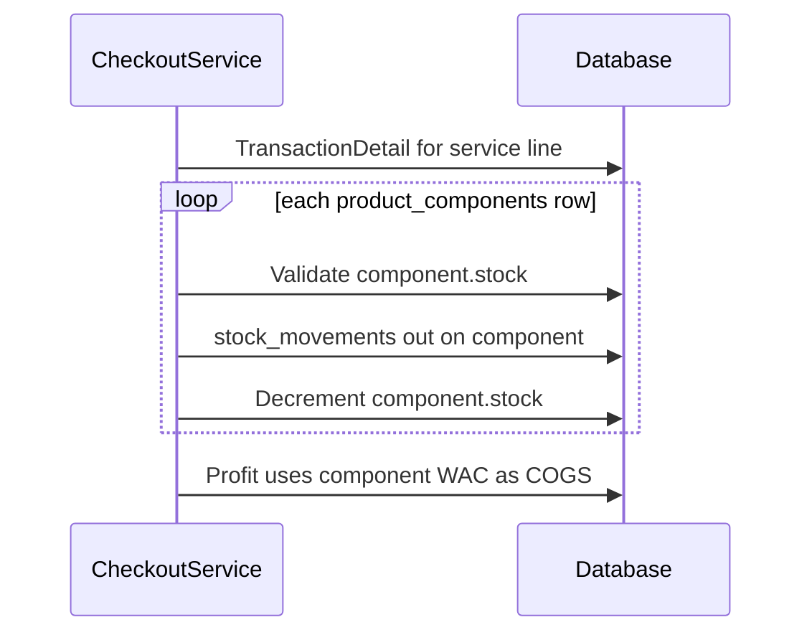
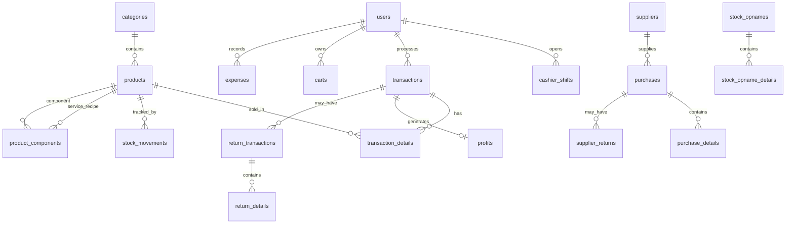
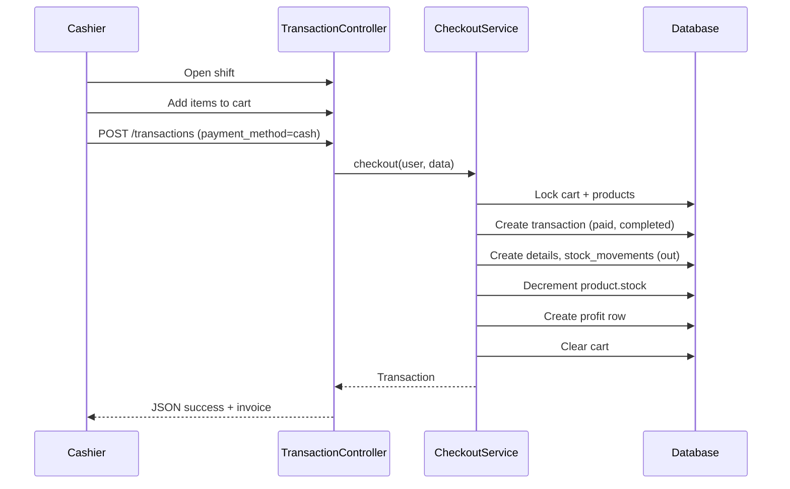
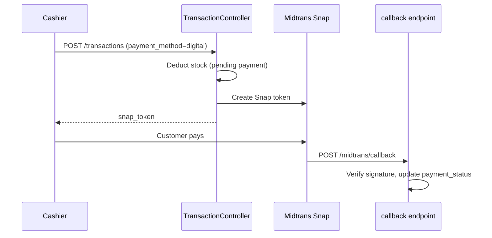
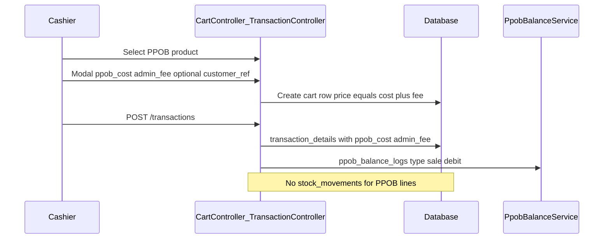

**Purpose**: Technical reference for understanding system design and development patterns  
**Last Updated**: 2026-06-26 (Service products with BOM)

---

# System Architecture

## Project Overview

**POS Kasir** is a web-based Point of Sale and inventory management system for Indonesian retail operations. It covers cashier workflows (shift management, POS checkout, returns), purchasing and supplier returns, stock tracking, expense recording, and sales/profit/stock reporting. The UI is Indonesian-first (labels, validation messages, flash text).

## Technology Stack

| Layer | Technology |
|-------|------------|
| Backend | Laravel 12, PHP 8.2+ |
| Frontend | Inertia.js 3, React 19, Vite 7 |
| Styling | Bootstrap 5, React-Bootstrap, Tailwind CSS 4 |
| Auth & RBAC | Laravel session auth, Spatie Laravel Permission |
| Payments | Midtrans Snap (`midtrans/midtrans-php`) |
| Spreadsheet | Maatwebsite Excel (`maatwebsite/excel`) — product bulk import |
| Database | MySQL (default in `.env.example`); SQLite for PHPUnit (`:memory:`) |
| Dev tooling | Laravel Boost, Pint, PHPUnit, Pail |

## Directory Layout

```
app/
  Http/Controllers/Account/   # Feature controllers (POS, inventory, reports, etc.)
  Http/Controllers/Auth/      # Login/auth
  Http/Requests/              # FormRequest validation (checkout, cart, etc.)
  Http/Middleware/            # HandleInertiaRequests (shared props)
  Models/                     # Eloquent models
  Imports/                    # Maatwebsite Excel import classes (ProductsImport)
  Exports/                    # Excel export classes (ProductImportTemplate)
  Services/                   # CheckoutService, PpobBalanceService
database/
  migrations/                 # Domain schema (2026_05_16_*)
  seeders/                    # Permissions, roles, default users
resources/js/
  Pages/Account/              # Inertia page components (mirror controller names)
  Components/Sidebar.jsx      # Permission-gated navigation
  Layouts/Account.jsx         # Main authenticated shell
  Utils/                      # Permissions, format, role helpers
routes/web.php                # All web routes + Midtrans callback
config/
  roles.php, branding.php, midtrans.php, permission.php
```

## Core Components

### Authentication

- Session-based login at `/login` (`LoginController`).
- Authenticated users redirect to `account.dashboard`.
- Shared Inertia props: `auth.user`, `auth.permissions` (map of permission name → `true`), `store`, `flash`.

### Authorization (RBAC)

- **Spatie Permission** with `permission` middleware on every `/account/*` route.
- Default roles (`config/roles.php`): `admin`, `cashier`.
- Seeded in `PermissionsTableSeeder`, `RolesTableSeeder`, `UserTableSeeder`.
- Frontend mirrors backend: `Sidebar.jsx` and `hasAnyPermission()` hide menu items.
- **Admin scope**: `User::isAdminUser()` — admins see all cashiers' data; cashiers are scoped to their own `cashier_id` / `user_id`.

### Cashier Shift Gate

- POS (`transactions.create`) requires an **open** `CashierShift` (`User::activeCashierShift()`).
- Users without an active shift are redirected to open one first.

### POS & Cart

- **Cart** rows are per `cashier_id` (current user); managed via `CartController` (store/update/destroy).
- **Checkout** (`CheckoutService::checkout()` via `TransactionController@store`): locks cart + products, validates stock, applies discount, creates transaction + details, writes `stock_movements` (type `out`), decrements `products.stock`.
- **Cash**: `payment_status=paid`, `status=completed`, profit recorded immediately.
- **Digital**: `payment_method=digital`, Midtrans Snap token returned; stock deducted at checkout; profit recorded on callback when paid.

### Inventory

- **Purchases** (`PurchaseController`): inbound stock in **base units** via `conversion_factor`; updates **WAC** (`products.avg_cost`).
- **Supplier returns**: return goods to supplier against a purchase invoice.
- **Stock movements** (`StockMovementController`): manual adjustments (`adjustment` type).
- **Stock opname**: physical count session with per-product variance (`stock_opname_details`).
- **Product import** (`ProductImportController`): bulk-create physical products from `.xlsx`/`.csv` via Products index modal. Create-only (skip existing barcodes). Template columns: `category`, `barcode`, `title`, `description`, `buy_price`, `stock`, `unit`, `sell_price`. Auto-creates categories; unit must exist in `units`. Each row creates one base/default-sell `product_unit` and opening `stock_movements` when stock > 0. Permission: `products.create`.
- All monetary amounts and prices use **integer** (IDR, no decimals).

### Returns

- Customer returns (`ReturnTransactionController`) link to a completed paid transaction.
- Workflow: `pending` → `approved` / `rejected` (approval permission: `returns.approve`).
- Approved returns restore stock via `stock_movements` (type `in`).

### Reports & Dashboard

- **Dashboard** (`DashboardController`): today's sales, transactions, gross profit, expenses, net profit, low-stock alerts, active shift summary, recent transactions.
- **Sales report**, **profit report**, **stock report** — separate controllers under `/account/reports/*`.

### Settings

- Key-value `settings` table: `group=store` (store profile) and `group=ppob` (`ppob_admin_fee`, `ppob_min_balance_default`).

### Multi-UOM & WAC

- **`units`**: master UOM (pcs, box, lsn, …).
- **`product_units`**: per-product UOM with `conversion_factor`, `sell_price`, `is_base_unit`, `is_default_sell`. **Sell prices are edited here only** — not on a separate product-level field.
- **`products.stock`** is always in base units; sales/purchases convert via `conversion_factor`.
- **`products.avg_cost`**: weighted average cost (WAC) recalculated on each purchase; used for COGS and stock report valuation.
- **`products.buy_price`**: last purchase price (updated on purchase); **`products.sell_price`**: synced from default sell UOM for legacy/fallback.
- **Physical catalog (create)**: opening **`buy_price`** per base unit seeds initial WAC when adding opening stock; edit form shows WAC + last buy read-only.

### PPOB (digital products)

- **`products.product_type`**: `physical` | `ppob` | `service`.
- **Catalog (admin)**: PPOB products need barcode, title, category only — `buy_price` / `sell_price` optional (stored as 0); image optional. UI hides price fields when type is PPOB (`Products/Create.jsx`, `Edit.jsx`). Default display unit: `lembar`.
- **POS checkout**: Cashier enters **`ppob_cost`** (from provider app); **`admin_fee`** pre-filled from `settings.ppob_admin_fee` (editable); optional **`customer_ref`**. Sell price = cost + fee; profit = `admin_fee × qty`. No stock movement.
- **`ppob_accounts`** + **`ppob_balance_logs`**: saldo ledger (`top_up`, `sale`, `adjustment`); auto-debit `ppob_cost × qty` on sale via `PpobBalanceService`.
- **`cashier_shifts`**: optional `ppob_opening_balance` / `ppob_closing_balance` for shift reconciliation vs `ppob_expected_balance`.

### Service products & BOM

- **`products.product_type = service`**: fixed sell price, no own stock (`stock = 0`). Examples: laminating, print, fotocopy.
- **`product_components`**: recipe rows linking `service_product_id` → `component_product_id` with `qty_per_unit` (component base units consumed per service unit sold).
- **Catalog (admin)**: service products need barcode, title, category, sell price, display unit, and at least one physical component. UI: `Products/Create.jsx`, `Edit.jsx` + `ProductComponentBuilder.jsx`.
- **POS checkout**: service lines behave like physical (click to add, fixed price). `CheckoutService` deducts each component's stock, writes `stock_movements` (type `out`) on components (not the service SKU), and sets line `buy_price` = sum of component WAC × recipe qty.
- **Void**: restores stock by reversing all `stock_movements` (`out` → `in`) for the transaction — covers both physical lines and service-consumed components.
- **Stock report**: scoped to `physical()` products only; services excluded from inventory valuation.



## Database Schema

### Entity Relationships (summary)



### Domain Tables

| Table | Purpose |
|-------|---------|
| `users` | Staff accounts (admin, cashier) |
| `categories` | Product grouping |
| `products` | SKU: barcode, stock (base units), `avg_cost`, `product_type` (`physical`/`ppob`/`service`); legacy `unit` string synced from base UOM |
| `product_components` | Service BOM: `service_product_id`, `component_product_id`, `qty_per_unit` |
| `units`, `product_units` | Multi-UOM definitions |
| `ppob_accounts`, `ppob_balance_logs` | PPOB provider wallet ledger |
| `suppliers`, `customers` | Master data |
| `carts` | Per-cashier basket: `unit_id`, `price`; PPOB rows add `ppob_cost`, `admin_fee`, `customer_ref` (no unique product constraint) |
| `transactions` | Sales invoices; payment + void state |
| `transaction_details` | Line items: `unit_id`, `conversion_factor`, snapshot `buy_price`; PPOB fields `ppob_cost`, `admin_fee`, `customer_ref` |
| `profits` | Per-transaction revenue/cost/profit (`transaction_id` unique) |
| `cashier_shifts` | Open/close with cash + optional PPOB balance reconciliation fields |
| `purchases`, `purchase_details` | Supplier inbound |
| `supplier_returns`, `supplier_return_details` | Return to supplier |
| `stock_movements` | Audit log: `in` / `out` / `adjustment`; polymorphic `reference_type/id` |
| `stock_opnames`, `stock_opname_details` | Physical inventory count |
| `return_transactions`, `return_details` | Customer returns |
| `expenses` | Operational expenses by date/category |
| `settings` | Store configuration key-value |
| Spatie tables | `roles`, `permissions`, pivots |

### Transaction Status Enums

- `payment_status`: `unpaid`, `pending`, `paid`, `expired`, `failed`
- `status`: `pending`, `completed`, `voided`
- Invoice format: `TRX-YYYYMMDD-XXXXXX`

## API & Routes

All authenticated routes are prefixed `/account` with name prefix `account.`. Permission middleware is applied per action.

| Area | Key routes |
|------|------------|
| Dashboard | `GET /account/dashboard` |
| Master data | `categories`, `suppliers`, `customers`, `products`, `units` (resource) |
| PPOB | `ppob-accounts`, `ppob-balance-logs` |
| Inventory | `stock-movements`, `stock-opnames`, `purchases`, `supplier-returns` |
| POS | `GET/POST /account/transactions`, cart CRUD, `PUT .../void` |
| Returns | `GET/POST /account/returns`, `PUT .../approve` |
| Shifts | `cashier-shifts` resource + `PUT .../close` |
| Reports | `/account/reports/sales`, `profit`, `stock` |
| Admin | `roles`, `users`, `settings`, `expenses` |
| Public | `POST /midtrans/callback` (CSRF exempt) |

Route definitions: `routes/web.php`.

## Data Flow

### Sale (cash)



### Sale (digital / Midtrans)



### Stock audit trail

Every stock change should create a `stock_movements` row with `stock_before`, `stock_after`, and optional polymorphic reference (`Transaction`, `Purchase`, etc.). **PPOB sales do not write stock movements.**

### PPOB sale (POS)



## Frontend Patterns

- Entry: `resources/js/app.jsx` — Inertia resolves `./Pages/{name}.jsx`.
- Layout: `Layouts/Account.jsx` — sidebar, store branding, logout.
- Permissions: check `auth.permissions` before rendering actions (same names as backend).
- Alerts: SweetAlert2 used on POS and forms.
- Money display: `Utils/format.js`.

## Security Implementation

- CSRF on all web routes except `midtrans/callback` (`bootstrap/app.php`).
- Login rate limiting: `throttle:5,1` on `POST /login`.
- Route-level `permission:*` middleware (Spatie).
- Midtrans callback validates SHA-512 `signature_key`; inbound notifications logged via `Log::info` / `Log::warning`.
- Checkout failures logged via `Log::error` in `TransactionController@store` and Snap token creation.
- Cashier data isolation via `isAdminUser()` checks in controllers.
- DB transactions + `lockForUpdate()` on checkout and void flows.

## Deployment & Local Dev

```bash
composer setup    # install, .env, key, migrate, npm build
composer dev      # php artisan serve + queue + pail + vite (concurrent)
php artisan migrate --seed   # permissions, roles, default users
```

**Default seeded users** (see `UserTableSeeder`):

| Email | Role | Password |
|-------|------|----------|
| admin@gmail.com | admin | password |
| kasir@gmail.com | cashier | password |

**Environment variables** (non-secret names):

- `APP_URL`, `DB_*` (MySQL default: `DB_CONNECTION=mysql`, database `pos_kasir`), `STORE_LOGO_PATH`
- `MIDTRANS_SERVER_KEY`, `MIDTRANS_CLIENT_KEY`, `MIDTRANS_IS_PRODUCTION` (`config/midtrans.php`)

**Testing**: `php artisan test` uses SQLite in-memory via `phpunit.xml` (`DB_CONNECTION=sqlite`, `DB_DATABASE=:memory:`).

**URLs**: Laravel `php artisan serve` defaults to `http://127.0.0.1:8000`. Vite HMR runs on its own port via `npm run dev`.

**Storage**: Product images → `storage/products/`; settings logo → `storage/settings/`.
