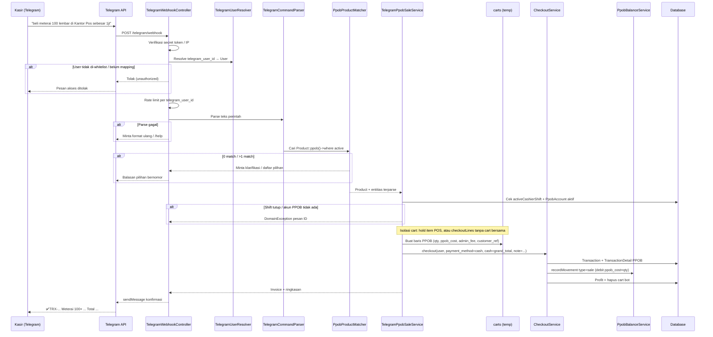
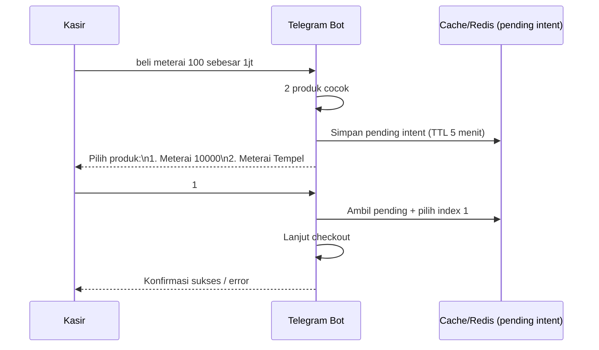

# Rencana Teknis: Integrasi Telegram Bot → POS Kasir (PPOB)

**Status**: Draft rencana (belum diimplementasi)  
**Tanggal**: 2026-07-20  
**Scope v1**: Transaksi PPOB via perintah teks Telegram  
**Referensi codebase**: Laravel 12 + Inertia/React — lihat `docs/architecture.md`, `MEMORY.md` (POS-003, POS-011, POS-012, POS-017)

---

## 1. Overview & tujuan

### Tujuan

Kasir/admin dapat mencatat penjualan PPOB dari Telegram tanpa membuka UI POS, dengan perintah bahasa alami, misalnya:

> `beli meterai 100 lembar di Kantor Pos sebesar 1jt`

Sistem harus:

1. Menerima update dari Telegram Bot API  
2. Mem-parse perintah → produk, qty, `customer_ref`, biaya  
3. Mencari produk `product_type=ppob` yang aktif  
4. Menghitung harga jual (`ppob_cost + admin_fee`) per unit  
5. Membuat transaksi lewat logika yang sama dengan POS (`CheckoutService` + `PpobBalanceService`)  
6. Membalas konfirmasi (invoice, rincian, saldo PPOB jika relevan)

### Non-tujuan (v1)

- Penjualan produk fisik / service via Telegram  
- Midtrans / pembayaran digital dari bot  
- Buka/tutup shift via Telegram (shift tetap di web)  
- Chat grup multi-user tanpa mapping (hanya DM / user yang di-whitelist)  
- Integrasi provider PPOB otomatis (biaya tetap diinput manual di perintah, seperti modal POS)

### Prinsip desain

- **Reuse, jangan duplikasi**: debit saldo PPOB, profit, invoice, dan validasi shift harus tetap lewat `CheckoutService` / `PpobBalanceService`.  
- **Jangan ganggu cart POS**: cart kasir dipakai UI (`CartController`); checkout bot tidak boleh ikut menjual item keranjang POS yang sedang aktif.  
- **Uang = integer IDR** (MEMORY POS-008).  
- **Shift wajib terbuka** (MEMORY POS-003) — bot menolak jika `User::activeCashierShift()` kosong.

---

## 2. Flow diagram (Mermaid sequence)



### Alur klarifikasi (multiple match / konfirmasi)



---

## 3. Arsitektur: komponen baru + file yang perlu dibuat/diubah

### Komponen baru (usulan)

| Komponen | Tanggung jawab |
|----------|----------------|
| `TelegramWebhookController` | Terima update, verifikasi, dispatch, balas cepat (`200 OK`) |
| `TelegramBotClient` | Wrapper HTTP `sendMessage`, `answerCallbackQuery`, dll. |
| `TelegramUserResolver` | Map `telegram_id` → `users` + cek whitelist/aktif |
| `TelegramCommandParser` | Ekstrak intent + entitas dari teks |
| `PpobProductMatcher` | Cari `Product` PPOB by title/barcode/alias (fuzzy ringan) |
| `TelegramPpobSaleService` | Orkestrasi: validasi → cart terisolasi → `CheckoutService` → format balasan |
| `TelegramMoneyParser` | Parse `1jt`, `1.000.000`, `Rp 500rb` → integer |
| Middleware / throttle | Rate limit + secret token webhook |
| Migration | Kolom mapping Telegram di `users` (+ opsional tabel log) |
| Config | `config/telegram.php` |
| Tests | Parser, matcher, sale service, webhook auth |

### File yang perlu **dibuat**

```
app/Http/Controllers/Telegram/TelegramWebhookController.php
app/Services/Telegram/TelegramBotClient.php
app/Services/Telegram/TelegramUserResolver.php
app/Services/Telegram/TelegramCommandParser.php
app/Services/Telegram/TelegramMoneyParser.php
app/Services/Telegram/PpobProductMatcher.php
app/Services/Telegram/TelegramPpobSaleService.php
app/Http/Middleware/VerifyTelegramWebhook.php   # opsional; bisa inline di controller
config/telegram.php
database/migrations/xxxx_add_telegram_fields_to_users_table.php
database/migrations/xxxx_create_telegram_command_logs_table.php  # opsional audit
tests/Unit/Telegram/TelegramCommandParserTest.php
tests/Unit/Telegram/TelegramMoneyParserTest.php
tests/Unit/Telegram/PpobProductMatcherTest.php
tests/Feature/Telegram/TelegramWebhookTest.php
tests/Feature/Telegram/TelegramPpobSaleTest.php
```

### File yang perlu **diubah**

| File | Perubahan |
|------|-----------|
| `routes/web.php` | Tambah `POST /telegram/webhook` (publik, mirip Midtrans) |
| `bootstrap/app.php` | CSRF except `telegram/webhook` (sama pola `midtrans/callback`) |
| `.env.example` | `TELEGRAM_BOT_TOKEN`, `TELEGRAM_WEBHOOK_SECRET`, `TELEGRAM_ALLOWED_IDS`, dll. |
| `app/Models/User.php` | Field `telegram_id`, `telegram_username`; helper `findByTelegramId()` |
| `app/Services/CheckoutService.php` | **Disarankan**: method `checkoutFromLines(User, array $lines, array $data)` agar bot tidak bergantung pada cart UI; **atau** isolasi cart via `is_held` (lihat §3.1) |
| `app/Http/Controllers/Account/CartController.php` | Catatan: `storePpobCart()` selalu `qty = 1` — bot **jangan** pakai method ini untuk qty > 1; perbaiki qty PPOB di UI bisa backlog terpisah |
| `app/Http/Controllers/Account/UserController.php` + form User | UI admin: isi/edit `telegram_id` (fase 2) |
| `database/seeders/PermissionsTableSeeder.php` | Opsional permission `telegram.manage` untuk set mapping |
| `docs/architecture.md` | Setelah implementasi: section Telegram + sequence |
| `MEMORY.md` | Gotcha webhook, shift, isolasi cart |
| `docs/todo.md` / `docs/backlog.md` | Track fase |

### 3.1 Isolasi cart vs `checkoutFromLines` (keputusan teknis penting)

**Masalah**: `CheckoutService::checkout()` mengambil **semua** `Cart` kasir dengan `is_held = false`. Jika kasir sedang punya item di POS lalu bot checkout, item POS ikut terjual.

**Opsi A — Hold & restore (minimal ubah CheckoutService)**

1. Set `is_held = true` pada semua cart POS milik user  
2. Buat baris cart PPOB bot (`is_held = false`) dengan `qty` benar  
3. Panggil `CheckoutService::checkout()`  
4. Un-hold cart POS  

Risiko: race jika kasir klik checkout POS bersamaan.

**Opsi B — `checkoutFromLines()` (direkomendasikan)**

Ekstrak loop pembuatan detail dari `CheckoutService` agar menerima array line items (product_id, qty, price, ppob_*, unit_id) tanpa baca tabel `carts`. Bot memanggil method ini; UI POS tetap pakai cart seperti sekarang.

```php
// Pseudocode — signature usulan
public function checkoutFromLines(User $user, array $lines, array $data): Transaction
```

**Rekomendasi v1**: Opsi B. Sedikit lebih banyak refactor, tapi aman untuk concurrent POS + bot dan menyembuhkan keterbatasan `storePpobCart` (`qty` selalu 1).

### 3.2 Mapping data perintah → model existing

Contoh perintah: `beli meterai 100 lembar di Kantor Pos sebesar 1jt`

| Entitas perintah | Field / perilaku di sistem |
|------------------|----------------------------|
| produk `meterai` | `Product` where `product_type=ppob`, `is_active=true`, match `title`/`barcode` |
| qty `100` | `carts.qty` / line `qty` |
| `lembar` | Informasional (PPOB catalog default unit `lembar`); tidak wajib `unit_id` (PPOB `unit_id=null` di cart) |
| `di Kantor Pos` | `customer_ref` (string, max 100 — selaras `StoreCartRequest`) |
| `sebesar 1jt` | Total biaya provider → `ppob_cost` **per unit** = `1_000_000 / 100` = `10_000` |
| admin fee | Default `Setting::ppobSettings()['ppob_admin_fee']` (biasanya 2000); override opsional di perintah |
| pembayaran | v1: `payment_method=cash`, `cash=grand_total` (lunas tunai, seperti kasir sudah terima) |
| kasir | `User` hasil mapping Telegram → `cashier_id` transaksi |
| shift | `$user->activeCashierShift` wajib `open` — dipakai `cashier_shift_id` di `PpobBalanceService` |

**Rumus harga (sama POS)**:

- `price` per unit = `ppob_cost + admin_fee`  
- `grand_total` = `price × qty` (tanpa diskon v1)  
- Profit = `admin_fee × qty` (COGS = `ppob_cost × qty`)  
- Tidak ada `stock_movements` untuk PPOB

**Catatan qty di CartController**: UI POS menambah PPOB satu baris `qty=1` per klik. Bot harus mendukung `qty=N` dalam satu baris (seperti yang sudah didukung `CheckoutService`).

---

## 4. Telegram Bot setup (BotFather, env vars, webhook vs polling)

### 4.1 BotFather

1. Chat `@BotFather` → `/newbot` → simpan **bot token**  
2. Opsional: `/setcommands` untuk hint:

```
start - Mulai & cek status akun
help - Format perintah PPOB
beli - Contoh: beli meterai 100 sebesar 1jt
status - Cek shift & mapping
batal - Batalkan pending konfirmasi
```

3. Nonaktifkan group privacy jika nanti dipakai di grup (v1 disarankan **DM only**)

### 4.2 Environment variables

Tambah ke `.env` / `.env.example` (nama saja di docs; jangan commit secret):

| Variabel | Keterangan |
|----------|------------|
| `TELEGRAM_BOT_TOKEN` | Token dari BotFather |
| `TELEGRAM_BOT_USERNAME` | Opsional, untuk deep-link |
| `TELEGRAM_WEBHOOK_SECRET` | Random string; dikirim sebagai header `X-Telegram-Bot-Api-Secret-Token` |
| `TELEGRAM_ALLOWED_CHAT_IDS` | Opsional CSV whitelist chat_id (defense in depth) |
| `TELEGRAM_MODE` | `webhook` (prod) \| `polling` (dev lokal) |
| `TELEGRAM_PARSE_MODE` | `HTML` atau `MarkdownV2` untuk format balasan |

`config/telegram.php`:

```php
return [
    'token' => env('TELEGRAM_BOT_TOKEN'),
    'webhook_secret' => env('TELEGRAM_WEBHOOK_SECRET'),
    'allowed_chat_ids' => array_filter(array_map('trim', explode(',', env('TELEGRAM_ALLOWED_CHAT_IDS', '')))),
    'mode' => env('TELEGRAM_MODE', 'webhook'),
    'admin_fee_default_from_settings' => true,
];
```

### 4.3 Webhook vs polling

| Mode | Kapan | Cara |
|------|-------|------|
| **Webhook (rekomendasi produksi)** | Server punya HTTPS publik (`APP_URL`) | `setWebhook` ke `https://domain/telegram/webhook` + `secret_token` |
| **Polling (rekomendasi lokal)** | Dev tanpa tunnel, atau `php artisan serve` | Artisan command `telegram:poll` loop `getUpdates` |

**Produksi — set webhook** (satu kali / saat deploy):

```bash
curl "https://api.telegram.org/bot${TELEGRAM_BOT_TOKEN}/setWebhook" \
  -d "url=${APP_URL}/telegram/webhook" \
  -d "secret_token=${TELEGRAM_WEBHOOK_SECRET}" \
  -d "allowed_updates[]=message" \
  -d "allowed_updates[]=callback_query"
```

**Lokal — polling**:

```bash
php artisan telegram:poll
# atau via composer dev process terpisah
```

Jangan jalankan webhook + polling bersamaan untuk bot yang sama.

### 4.4 Route & CSRF

Di `routes/web.php` (di luar grup `auth`), sejajar Midtrans:

```php
Route::post('/telegram/webhook', [TelegramWebhookController::class, 'handle'])
    ->middleware('throttle:60,1')
    ->name('telegram.webhook');
```

Di `bootstrap/app.php`:

```php
$middleware->validateCsrfTokens(except: [
    'midtrans/callback',
    'telegram/webhook',
]);
```

Verifikasi: bandingkan header `X-Telegram-Bot-Api-Secret-Token` dengan `config('telegram.webhook_secret')`. Tolak 403 jika mismatch.

---

## 5. Strategi command parsing (regex vs LLM)

| Pendekatan | Kelebihan | Kekurangan | Fit untuk POS ini |
|------------|-----------|------------|-------------------|
| **Regex / grammar ringan** | Deterministik, cepat, gratis, mudah ditest | Perlu daftar pola; kurang fleksibel untuk kalimat acak | **Sangat cocok v1** |
| **LLM (OpenAI dll.)** | Bahasa bebas | Biaya, latency, non-deterministik, perlu validasi ketat output JSON, dependency API | Overkill untuk domain sempit PPOB |
| **Hybrid** | Regex dulu; LLM hanya jika gagal | Kompleksitas 2 jalur | Pertimbangkan v2 jika kasir sering typo berat |

### Rekomendasi: **regex + normalisasi + konfirmasi**, bukan LLM

Alasan spesifik repo ini:

1. Domain perintah sempit: beli PPOB + qty + uang + opsional lokasi/ref.  
2. Produk PPOB terbatas; matcher DB lebih penting daripada NLP generik.  
3. Kesalahan parse = risiko transaksi uang nyata → determinisme lebih aman.  
4. PHPUnit mudah menutupi kasus `1jt`, `500rb`, `Rp1.000.000`.

### Pipeline parse (v1)

1. Normalize: lowercase, trim, ganti koma/titik ribuan secara hati-hati, expand `jt`/`rb`/`rp`.  
2. Deteksi intent: awalan `beli` / `ppob` / `jual` (opsional).  
3. Ekstrak uang: pola `sebesar|harga|biaya|total|rp` + amount.  
4. Ekstrak qty: `\d+` dekat satuan `lembar|lbr|pcs|buah` atau angka sebelum nama produk.  
5. Ekstrak ref: setelah `di|untuk|ref|customer`.  
6. Sisa token = query produk.  
7. Validasi: qty ≥ 1, amount > 0, amount % qty == 0 (atau round policy — lihat open questions).

Jika parse gagal → balas template `/help`, jangan menebak transaksi.

---

## 6. Format perintah yang didukung + entitas yang diekstrak

### 6.1 Format utama (v1)

```
beli <produk> <qty> [satuan] [di|untuk <customer_ref>] sebesar <jumlah_uang> [admin <biaya_admin>]
```

### 6.2 Contoh valid

| Input | Produk query | Qty | customer_ref | Total biaya (ppob) | admin_fee |
|-------|--------------|-----|--------------|--------------------|-----------|
| `beli meterai 100 lembar di Kantor Pos sebesar 1jt` | meterai | 100 | Kantor Pos | 1_000_000 | default setting |
| `beli meterai 100 sebesar 1000000` | meterai | 100 | null | 1_000_000 | default |
| `ppob pulsa 1 sebesar 25rb admin 2000` | pulsa | 1 | null | 25_000 | 2_000 |
| `beli TOKEN LISTRIK 1 untuk 1234567890 sebesar 100rb` | token listrik | 1 | 1234567890 | 100_000 | default |

### 6.3 Slash commands

| Command | Fungsi |
|---------|--------|
| `/start` | Sapaan + status mapping + apakah shift terbuka |
| `/help` | Tampilkan format + contoh |
| `/status` | User Laravel, shift open/close, nama akun PPOB aktif |
| `/batal` | Hapus pending intent di cache |
| `1` / `2` / … | Pilih hasil multiple match (saat pending) |
| `ya` / `tidak` | Konfirmasi transaksi jika mode konfirmasi aktif (fase 1.5) |

### 6.4 Entitas terstruktur (DTO internal)

```text
TelegramPpobIntent {
  raw: string
  product_query: string
  qty: int
  customer_ref: ?string
  total_ppob_cost: int      // "sebesar 1jt" → 1000000
  unit_ppob_cost: int       // total / qty
  admin_fee: ?int           // null = pakai Setting::ppobSettings()
  payment_method: 'cash'    // fixed v1
}
```

### 6.5 Aturan uang

`TelegramMoneyParser` harus mendukung:

- `1jt` / `1 juta` → 1_000_000  
- `500rb` / `500ribu` → 500_000  
- `1.000.000` / `1000000` / `Rp 1.000.000`  
- Tolak desimal (IDR integer)

### 6.6 Yang sengaja tidak didukung v1

- Multi-produk dalam satu pesan  
- Diskon  
- `payment_method=digital|qris|transfer` (bisa ditambah nanti dengan kata kunci)  
- Void transaksi via Telegram (butuh permission `transactions.void` + konfirmasi ketat)

---

## 7. Security: whitelist, rate limiting, mapping user

### 7.1 Mapping Telegram → Laravel `User`

Migration pada `users`:

| Kolom | Tipe | Keterangan |
|-------|------|------------|
| `telegram_id` | `unsignedBigInteger` nullable unique | `from.id` dari Telegram |
| `telegram_username` | `string` nullable | informatif, bisa berubah |
| `telegram_linked_at` | `timestamp` nullable | audit |

Alur link (pilih salah satu untuk v1):

1. **Admin set manual** di edit User (paling sederhana, cocok internal)  
2. **Kode pairing**: user ketik `/start <kode>` yang digenerate di web (lebih aman remote)

Resolver:

```text
telegram_id → User where telegram_id = ? AND is_active (jika ada flag)
→ cek permission transactions.create (atau role cashier/admin)
→ gagal = tolak
```

### 7.2 Whitelist berlapis

1. Webhook secret token (wajib)  
2. `users.telegram_id` harus terisi (implicit allowlist)  
3. Opsional: `TELEGRAM_ALLOWED_CHAT_IDS`  
4. Opsional: hanya terima `message.chat.type === private`

### 7.3 Rate limiting

- Route throttle: `60/min` per IP (Telegram server)  
- Application throttle: mis. **5 perintah beli / menit / telegram_id** via `RateLimiter`  
- Pending intent: max 1 per user, TTL 5 menit  

### 7.4 Authorization bisnis

- Permission Spatie: minimal `transactions.create` (sama POS)  
- Shift terbuka: sama `CheckoutService` / `TransactionController`  
- Jangan elevate privilege: transaksi selalu atas nama mapped user (bukan system user)

### 7.5 Audit log (disarankan)

Tabel `telegram_command_logs`:

- `telegram_id`, `user_id`, `raw_text`, `parsed_json`, `status` (`ok`/`rejected`/`error`), `invoice`, `error_message`, timestamps  

Jangan log bot token. Mask sebagian jika ada data sensitif di `customer_ref` (opsional).

### 7.6 Replay & idempotency

Simpan `update_id` Telegram yang sudah diproses (cache/DB) agar retry webhook tidak double-charge PPOB.

---

## 8. Implementation plan per fase + estimasi effort

Estimasi untuk 1 developer yang sudah familiar repo (relative).

### Fase 0 — Persiapan (0.5 hari)

- Buat bot BotFather, isi `.env` lokal  
- Putuskan webhook (tunnel) vs polling untuk dev  
- Putuskan Opsi B `checkoutFromLines` vs hold-cart  
- Update `docs/todo.md` dengan task breakdown

### Fase 1 — Fondasi webhook + auth (1–1.5 hari)

- Migration `telegram_id` pada `users`  
- `config/telegram.php`, CSRF except, route webhook  
- `TelegramBotClient`, `VerifyTelegramWebhook`, `TelegramUserResolver`  
- `/start`, `/help`, `/status`  
- Feature test: secret salah → 403; user belum map → pesan tolak  
- Seed/manual: link `telegram_id` ke user `kasir`

### Fase 2 — Parser + product matcher (1–1.5 hari)

- `TelegramMoneyParser` + unit tests (jt/rb/titik)  
- `TelegramCommandParser` + tests untuk contoh di §6  
- `PpobProductMatcher`: `Product::ppob()->where('is_active', true)` LIKE title/barcode; ranking sederhana; multiple match → list  
- Cache pending intent (Laravel Cache)

### Fase 3 — Sale orchestration + CheckoutService (1.5–2 hari)

- Refactor: `CheckoutService::checkoutFromLines()` (rekomendasi) — ekstrak dari loop cart existing; `checkout()` memanggil ulang dari isi cart  
- `TelegramPpobSaleService`: build lines, default admin fee dari `Setting::ppobSettings()`, panggil checkout, format balasan  
- Edge cases: shift tutup, no PPOB account, produk inactive, amount tidak divisible  
- Feature test: sale sukses → ada `transactions`, `transaction_details` PPOB, `ppob_balance_logs`, `profits`

### Fase 4 — Hardening & UX bot (1 hari)

- Rate limit, idempotency `update_id`  
- Mode konfirmasi opsional sebelum commit (`Konfirmasi? ya/tidak`) untuk transaksi > threshold (mis. ≥ 500rb)  
- Logging terstruktur (`Log::info` pola Midtrans)  
- Command `telegram:set-webhook` / `telegram:poll`  
- Dokumentasi di `docs/architecture.md` + `MEMORY.md`

### Fase 5 — Admin UX mapping (0.5–1 hari, bisa paralel)

- Field Telegram di form Users (`UserController` + React Edit/Create)  
- Atau halaman Settings grup `telegram`

**Total v1 MVP (Fase 0–3)**: ~4–5 hari  
**Dengan hardening + UI mapping (0–5)**: ~6–7 hari  

---

## 9. Edge cases & error handling

| Situasi | Perilaku bot |
|---------|----------------|
| User Telegram belum di-map | "Akun Telegram belum terhubung. Hubungi admin." |
| User tanpa permission `transactions.create` | Tolak |
| Shift belum buka | "Buka shift kasir di aplikasi dulu sebelum transaksi Telegram." (pesan selaras `CheckoutService`) |
| Tidak ada `PpobAccount` aktif | "Akun PPOB aktif belum dikonfigurasi." |
| Produk 0 match | "Produk PPOB tidak ditemukan untuk: …" + saran `/help` |
| Produk >1 match | Kirim list bernomor; tunggu balasan `1`/`2`; TTL 5 menit |
| Produk inactive | Dianggap tidak ada / jangan ditawarkan |
| Qty ≤ 0 / non-numerik | Tolak parse |
| Amount tidak bisa dibagi qty | Tolak **atau** round down + tampilkan sisa (keputusan open question); default usulan: **tolak** agar `ppob_cost` integer bersih |
| `customer_ref` > 100 karakter | Truncate dengan peringatan atau tolak |
| Saldo PPOB tidak dicek ketat di checkout hari ini | Tetap catat sale (perilaku existing ledger); opsional: warning jika `current_balance` rendah (`isLowBalance`) sebelum konfirmasi |
| Kasir punya item di cart POS | Aman jika pakai `checkoutFromLines`; jika hold-cart, dokumentasikan race |
| Double webhook | Idempotency by `update_id` |
| Exception tak terduga | Log error; balas "Terjadi kesalahan sistem." (jangan bocorkan stack) |
| `DomainException` dari CheckoutService | Teruskan `getMessage()` ke user (sudah bahasa Indonesia) |
| Pending intent expired | "Sesi pilihan habis. Kirim ulang perintah." |
| Perintah void / fisik | "Belum didukung. Hanya PPOB via beli …" |

---

## 10. Contoh percakapan bot

### Sukses (match tunggal)

```
Kasir: beli meterai 100 lembar di Kantor Pos sebesar 1jt

Bot:
✅ Transaksi PPOB berhasil

Invoice: TRX-20260720-A1B2C3
Produk: Meterai Tempel
Qty: 100 lembar
Ref: Kantor Pos
Biaya PPOB: Rp 10.000 × 100 = Rp 1.000.000
Admin: Rp 2.000 × 100 = Rp 200.000
Total: Rp 1.200.000
Kasir: Budi
Shift: #42 (open)
```

### Multiple match

```
Kasir: beli meterai 50 sebesar 500rb

Bot:
Ditemukan 2 produk. Balas angka pilihan:
1. Meterai 10000 (barcode: MTR-10)
2. Meterai Tempel (barcode: MTR-TMP)

Kasir: 2

Bot:
✅ Transaksi PPOB berhasil
Invoice: TRX-20260720-D4E5F6
...
```

### Shift belum buka

```
Kasir: beli pulsa 1 sebesar 25rb

Bot:
❌ Buka shift kasir terlebih dahulu sebelum memproses transaksi.
Buka shift di: /account/cashier-shifts/create
```

### Belum terhubung

```
Kasir: /start

Bot:
Halo. Akun Telegram ini belum terhubung ke POS Kasir.
Minta admin mengisi Telegram ID: 123456789 pada master User.
```

### Parse gagal

```
Kasir: tolong catat meterai ya

Bot:
Tidak bisa membaca perintah.
Format:
beli <produk> <qty> [di <ref>] sebesar <uang>

Contoh:
beli meterai 100 lembar di Kantor Pos sebesar 1jt
```

### Konfirmasi nilai besar (fase 4)

```
Kasir: beli meterai 500 sebesar 5jt

Bot:
Konfirmasi transaksi:
Meterai × 500
Biaya: Rp 5.000.000 + admin Rp 1.000.000
Total: Rp 6.000.000
Balas "ya" untuk proses, "tidak" untuk batal.

Kasir: ya
Bot: ✅ TRX-...
```

---

## 11. Open questions

1. **`ppob_cost` dari total vs per lembar** ✅ DIPUTUSKAN  
   **Konteks-based**: keyword `total` = total biaya semua, `@` = per unit.
   - `beli meterai 100 total 1jt` → ppob_cost = 1.000.000 / 100 = 10.000/lembar
   - `beli meterai 100 @10rb` → ppob_cost = 10.000/lembar
   - Default (tanpa keyword): **tolak + minta klarifikasi**

2. **Pembagian tidak bulat**  
   Jika `1_000_001 / 100` — tolak, atau round, atau simpan cost total di satu baris `qty=1` dengan ref "100 lembar"? (Disarankan: tolak + minta angka yang divisible.)

3. **Konfirmasi sebelum commit**  
   Selalu konfirmasi, hanya di atas threshold, atau langsung commit (lebih cepat, lebih berisiko)?

4. **Payment method**  
   v1 cash-only OK? Atau default `transfer` / `qris` dengan keyword?

5. **Siapa yang boleh link Telegram**  
   Hanya admin edit user, atau self-service pairing code?

6. **Satu user / banyak Telegram**  
   Unique `telegram_id` → satu user. Apakah satu user boleh ganti nomor Telegram sering?

7. **Refactor `CheckoutService`** ✅ DIPUTUSKAN  
   **Opsi B `checkoutFromLines`** — refactor untuk ekstrak loop detail dari `checkout()` agar bisa dipanggil tanpa cart. Lebih aman concurrent, lebih bersih jangka panjang.

8. **Perbaiki `CartController::storePpobCart` qty=1**  
   Apakah ikut di scope (POS UI juga bisa qty > 1), atau tetap backlog terpisah?

9. **Alias produk**  
   Apakah perlu kolom `telegram_aliases` / tabel alias (`mtr` → Meterai), atau cukup fuzzy title?

10. **Notifikasi ke grup**  
    Setelah sukses, forward ringkasan ke grup supervisory? (di luar v1)

11. **Hosting webhook**  
    Produksi sudah HTTPS stabil? Jika belum, polling + supervisor/systemd dulu.

12. **Void via Telegram**  
    Diinginkan di v2? Butuh permission + alasan void.

---

## Lampiran A — Dependency ke kode existing (quick map)

| Kebutuhan bot | Lokasi existing |
|---------------|-----------------|
| Checkout + profit + PPOB ledger | `app/Services/CheckoutService.php` |
| Debit saldo PPOB | `app/Services/PpobBalanceService.php` (via CheckoutService) |
| Gate shift | `User::activeCashierShift()`, `CashierShift::isOpen()` |
| Default admin fee | `Setting::ppobSettings()` di `app/Models/Setting.php` |
| Cari produk PPOB | `Product::scopePpob()`, `isPpob()`, `is_active` |
| Pola cart PPOB fields | `CartController::storePpobCart()`, `StoreCartRequest` |
| CSRF public endpoint pattern | `bootstrap/app.php` + `midtrans/callback` |
| Permission transaksi | `permission:transactions.create` di `routes/web.php` |
| Format uang display | `resources/js/Utils/format.js` (port logika ke PHP helper kecil untuk balasan bot) |

## Lampiran B — Acceptance criteria MVP

- [ ] Webhook (atau polling) menerima pesan dan membalas dalam < 3 detik untuk happy path  
- [ ] Hanya user ter-map + berizin yang bisa transaksi  
- [ ] Perintah contoh meterai 100 / 1jt menghasilkan transaksi completed + paid + detail PPOB benar  
- [ ] `ppob_balance_logs` bertipe `sale` terisi dengan `cashier_shift_id`  
- [ ] Cart POS kasir tidak ikut ter-checkout  
- [ ] Shift tutup → ditolak dengan pesan jelas  
- [ ] Multiple product match → alur pilih angka berfungsi  
- [ ] PHPUnit hijau untuk parser + sale feature  
- [ ] Secret webhook invalid → 403  

---

*Dokumen ini adalah rencana teknis actionable. Implementasi dimulai setelah open questions kunci (terutama #1, #3, #7) diputuskan.*
